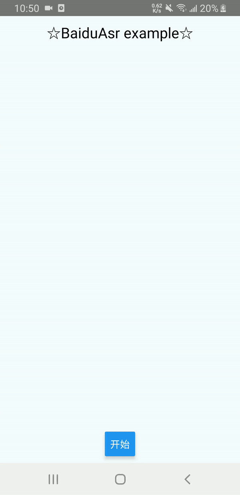

# react-native-baidu-asr

<p align="center">
  <a href="https://www.npmjs.com/package/react-native-baidu-asr">
    
  </a>
  <a href="https://www.npmjs.com/package/react-native-baidu-asr">
    
  </a>
  <a href="https://github.com/gdoudeng/react-native-baidu-asr/issues">
    
  </a>
  <a href="https://opensource.org/licenses/MIT">
    
  </a>
  <a href="#badge">
    
  </a>
</p>

`react-native-baidu-asr` 是一个 React Native 下的百度语音库，可以进行语音识别。

[English](./README.md) | 简体中文

## 预览

<p align="left">
  
</p>

## 支持平台
- React Native >= 0.47.0
- Android

当前并未实现iOS平台，我有空一定补上，还有语音合成和语音唤醒都会补上。

## 安装

- 对于RN >= 0.60

1. `yarn add react-native-baidu-asr`

- 对于RN < 0.60

1. `yarn add react-native-baidu-asr`

2. `react-native link react-native-baidu-asr`

## 使用

- 详见[example](https://github.com/gdoudeng/react-native-baidu-asr/tree/master/example)

首先是你先要去 [百度语音控制台](https://console.bce.baidu.com/ai/?_=1620713753811&fromai=1#/ai/speech/overview/index) 创建一个应用，拿到鉴权信息：AppID，API Key，Secret Key。

```typescript
import BaiduAsr, { RecognizerStatusCode, RecognizerData, RecognizerResultError, RecognizerResultData, VolumeData } from 'react-native-baidu-asr';

// 初始化百度语音引擎
BaiduAsr.init({
  APP_ID: '你的鉴权信息AppID',
  APP_KEY: '你的鉴权信息API Key',
  SECRET: '你的鉴权信息Secret Key',
});

// 处理识别结果
this.resultListener = BaiduAsr.addResultListener(this.onRecognizerResult);
// 处理错误结果
this.errorListener = BaiduAsr.addErrorListener(this.onRecognizerError);
// 处理音量大小
this.volumeListener = BaiduAsr.addAsrVolumeListener(this.onAsrVolume);

// 开始语音识别
// 更多输入参数请参考百度语音文档
// https://ai.baidu.com/ai-doc/SPEECH/bkh07sd0m#asr_start-%E8%BE%93%E5%85%A5%E4%BA%8B%E4%BB%B6%E5%8F%82%E6%95%B0
BaiduAsr.start({
  // 长语音
  VAD_ENDPOINT_TIMEOUT: 0,
  BDS_ASR_ENABLE_LONG_SPEECH: true,
  // 禁用标点符号
  DISABLE_PUNCTUATION: true,
});
```

## API

### 语音识别

#### Methods

- `BaiduAsr.init(options: InitOptions)`
  
初始化百度语音引擎

- `BaiduAsr.start(options: AsrOptions)`
  
开始语音识别

- `BaiduAsr.stop()`

暂停录音，SDK不会再识别停止后的录音。

- `BaiduAsr.cancel()`

取消录音，SDK会取消本次识别，回到原始状态。

- `BaiduAsr.release()`

释放资源，下次需要再次使用的话必须再调用`init`方法初始化引擎。

#### Events

识别结果回调数据有一个统一格式的，类似与api接口返回一样，有code，msg，data。

`RecognizerData`数据类型如下：
```typescript
interface RecognizerData<T = any> {
  /**
   * 状态码
   */
  code: RecognizerStatusCode,
  /**
   * 消息
   */
  msg: string,
  /**
   * 数据
   */
  data: T
}
```

- `addResultListener(callback: (data: RecognizerData<RecognizerResultData | undefined>) => void): EmitterSubscription`  
  语音识别结果回调，在语音识别时会不断触发该事件，`data` 为 `RecognizerData<RecognizerResultData | undefined>` 类型，其值：

    - `code`：状态码
    - `msg`：消息
    - `data`：识别数据

其中`data`数据类型如下：

```typescript
interface RecognizerResultData {
  best_result: string,
  // 如无意外 取第一个值就是识别结果
  results_recognition: Array<string>,
  result_type: ResultType,
  origin_result: {
    corpus_no: number,
    err_no: number,
    raf: number,
    result: {
      word: Array<string>
    },
    sn: string
  },
  error: number,
  desc: string
}
```

- `addErrorListener(callback: (data: RecognizerData<RecognizerResultError>) => void): EmitterSubscription`  
  语音识别出现错误，错误信息与百度语音文档保持一致，其值：

    - `code`：状态码
    - `msg`：消息
    - `data`：错误数据

其中`data`数据类型如下：

```typescript
interface RecognizerResultError {
  errorCode: number // 错误码对照百度语音文档 https://ai.baidu.com/ai-doc/SPEECH/qk38lxh1q
  subErrorCode: number
  descMessage: string
}
```

- `addAsrVolumeListener(listener: (volume: VolumeData) => void): EmitterSubscription`  
  语音识别的音量大小，当识别的语音改变音量时会触发该事件，`volume` 为 `VolumeData` 类型，其值：

    - `volumePercent`: 当前音量百分比
    - `volume`: 当前音量大小

## Contribute

期待提出有关建议，欢迎做出贡献，感谢star。  

[Github](https://github.com/gdoudeng/react-native-baidu-asr)

## License

[MIT License](https://github.com/gdoudeng/react-native-baidu-asr/blob/master/LICENSE)
