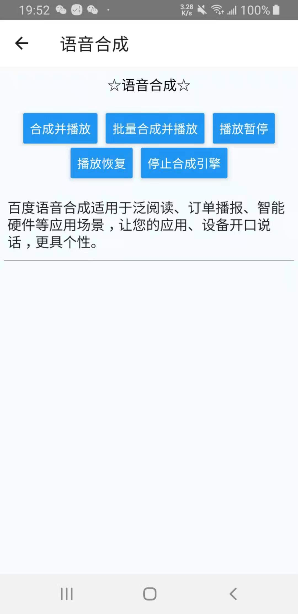

# react-native-baidu-asr

<p align="center">
  <a href="https://www.npmjs.com/package/react-native-baidu-asr">
    
  </a>
  <a href="https://www.npmjs.com/package/react-native-baidu-asr">
    
  </a>
  <a href="https://github.com/gdoudeng/react-native-baidu-asr/issues">
    
  </a>
  <a href="https://opensource.org/licenses/MIT">
    
  </a>
  <a href="#badge">
    
  </a>
</p>

`react-native-baidu-asr` It is a Baidu speech library under React Native, which can perform speech recognition, speech wake-up and speech synthesis.

English | [简体中文](./README-zh.md)

## Preview

<p align="left">
  
  
  
</p>

## Support

- React Native >= 0.47.0
- Android

Currently, the iOS platform is not implemented. I will fill it up when I have time.

## Install

- RN >= 0.60

1. `yarn add react-native-baidu-asr`

- RN < 0.60

1. `yarn add react-native-baidu-asr`

2. `react-native link react-native-baidu-asr`

## Usage

- See for details [example](https://github.com/gdoudeng/react-native-baidu-asr/tree/master/example)

The first is that you have to go to
the [Baidu Voice Console]((https://console.bce.baidu.com/ai/?_=1620713753811&fromai=1#/ai/speech/overview/index)) to
create an application, get authentication information: AppID, API Key, Secret Key.

- Speech Recognition

```typescript
import {
  BaiduAsr,
  StatusCode,
  IBaseData,
  RecognizerResultError,
  RecognizerResultData,
  VolumeData
} from 'react-native-baidu-asr';

// Initialize Baidu speech engine
BaiduAsr.init({
  APP_ID: 'Your authentication information AppID',
  APP_KEY: 'Your authentication information API Key',
  SECRET: 'Your authentication information Secret Key',
});

// Processing recognition results
this.resultListener = BaiduAsr.addResultListener(this.onRecognizerResult);
// Handling wrong results
this.errorListener = BaiduAsr.addErrorListener(this.onRecognizerError);
// Processing volume
this.volumeListener = BaiduAsr.addAsrVolumeListener(this.onAsrVolume);

// Start speech recognition
// For more input parameters, please refer to Baidu Voice Document
// https://ai.baidu.com/ai-doc/SPEECH/bkh07sd0m#asr_start-%E8%BE%93%E5%85%A5%E4%BA%8B%E4%BB%B6%E5%8F%82%E6%95%B0
BaiduAsr.start({
  // Long speech
  VAD_ENDPOINT_TIMEOUT: 0,
  BDS_ASR_ENABLE_LONG_SPEECH: true,
  // Disable punctuation
  DISABLE_PUNCTUATION: true,
});
```

- Voice wake

The first is to export [wake word](https://ai.baidu.com/tech/speech/wake#tech-demo) , Pre-defined wake words and custom wake words, both need to be exported and used by the wake word evaluation tool.

```typescript
import { BaiduWakeUp } from 'react-native-baidu-asr';

// Initialize Baidu speech engine
BaiduAsr.init({
  APP_ID: 'Your authentication information AppID',
  APP_KEY: 'Your authentication information API Key',
  SECRET: 'Your authentication information Secret Key',
});

// Wake up result
this.resultListener = BaiduWakeUp.addResultListener(this.onWakeUpResult);
// Handling wrong results
this.errorListener = BaiduWakeUp.addErrorListener(this.onWakeUpError);

// Start voice wake up
// For more input parameters, please refer to Baidu Voice Document
// https://ai.baidu.com/ai-doc/SPEECH/bkh07sd0m#wakeup_start-%E8%BE%93%E5%85%A5%E4%BA%8B%E4%BB%B6%E5%8F%82%E6%95%B0
BaiduWakeUp.start({
  // Indicates that the WakeUp.bin file is defined in the assets directory
  WP_WORDS_FILE: 'assets:///WakeUp.bin',
});
```

- Speech synthesis

The authentication information of speech synthesis is placed in [auth.properties](https://github.com/gdoudeng/react-native-baidu-asr/blob/master/example/android/app/src/main/assets/auth.properties)  in the `assets` directory, please refer to the example.

Then if you need to compile above api level 28, you also need to modify `AndroidManifest.xml`,

```xml
 <application
        android:name=".MainApplication"
        android:allowBackup="false"
        android:icon="@mipmap/ic_launcher"
        android:label="@string/app_name"
        android:roundIcon="@mipmap/ic_launcher_round"
        android:theme="@style/AppTheme">

        <!-- Add this sentence. Support api level 28 and above compilation-->
        <uses-library
            android:name="org.apache.http.legacy"
            android:required="false" />

        // ...
    
    </application>
```

```typescript
import {
  BaiduSynthesizer,
  SynthesizerData,
  SynthesizerResultData,
  SynthesizerResultError,
} from 'react-native-baidu-asr';

// initialization
BaiduSynthesizer.initialTts();

// Listen for events
this.resultListener = BaiduSynthesizer.addResultListener(
    this.onSynthesizerResult,
);
this.errorListener = BaiduSynthesizer.addErrorListener(
    this.onSynthesizerError,
);

// Speech synthesis
BaiduSynthesizer.speak(
    this.state.text,
    // For more input parameters, please refer to the Baidu documentation https://ai.baidu.com/ai-doc/SPEECH/Pk8446an5
    {
      PARAM_SPEAKER: '1',
    },
    status => {
      console.log('speak --> ', status);
    },
);

// Batch playback
BaiduSynthesizer.batchSpeak(
    [
      '开始批量播放',
      '123456',
      '欢迎使用百度语音',
      '重(chong2)量这个是多音字示例',
    ],
    // For more input parameters, please refer to the Baidu documentation https://ai.baidu.com/ai-doc/SPEECH/Pk8446an5
    {
      PARAM_SPEAKER: '1',
    },
    status => {
      console.log('batchSpeak --> ', status);
    },
);
```

## API

### Speech Recognition

#### Methods

- `BaiduAsr.init(options: InitOptions)`

Initialize Baidu speech engine

- `BaiduAsr.start(options: AsrOptions)`

Start speech recognition

- `BaiduAsr.stop()`

Pause the recording, the SDK will no longer recognize the stopped recording.

- `BaiduAsr.cancel()`

Cancel the recording, the SDK will cancel this recognition and return to the original state.

- `BaiduAsr.release()`

Release the resource. If you need to use it again next time, you must call the `init` method to initialize the engine.

#### Events

The recognition result callback data has a unified format, similar to the api interface return, with code, msg, and data.

`IBaseData` The data types are as follows：

```typescript
interface IBaseData<T = any> {
  /**
   * status code
   */
  code: StatusCode,
  /**
   * message
   */
  msg: string,
  /**
   * data
   */
  data: T
}
```

- `addResultListener(callback: (data: IBaseData<RecognizerResultData | undefined>) => void): EmitterSubscription`  
  Voice recognition result callback, the event will be triggered continuously during voice recognition，`data` is of
  type `IBaseData<RecognizerResultData | undefined>`，Its value：

    - `code`：status code
    - `msg`：message
    - `data`：Identification data

The data types of `data` are as follows:

```typescript
interface RecognizerResultData {
  best_result: string,
  // If there is no accident, the first value is the recognition result
  results_recognition: Array<string>,
  result_type: ResultType,
  origin_result: {
    corpus_no: number,
    err_no: number,
    raf: number,
    result: {
      word: Array<string>
    },
    sn: string
  },
  error: number,
  desc: string
}
```

- `addErrorListener(callback: (data: IBaseData<RecognizerResultError>) => void): EmitterSubscription`  
  There is an error in speech recognition. The error message is consistent with the Baidu speech document. Its value:

    - `code`：status code
    - `msg`：message
    - `data`：Wrong data

The data types of `data` are as follows:

```typescript
interface RecognizerResultError {
  errorCode: number // Error code comparison Baidu voice document https://ai.baidu.com/ai-doc/SPEECH/qk38lxh1q
  subErrorCode: number
  descMessage: string
}
```

- `addAsrVolumeListener(listener: (volume: VolumeData) => void): EmitterSubscription`  
  The volume of speech recognition. This event will be triggered when the recognized speech changes the volume. `volume`
  is of type `VolumeData`, and its value is:

    - `volumePercent`: Current volume percentage
    - `volume`: Current volume

### Voice wake

#### Methods

- `BaiduWakeUp.init(options: InitOptions)`

Initialize Baidu speech engine

- `BaiduWakeUp.start(options: WakeUpOptions)`

Start voice wake up

- `BaiduWakeUp.stop()`

End voice wakeup.

- `BaiduWakeUp.release()`

Release the resource. If you need to use it again next time, you must call the `init` method to initialize the engine.

#### Events

The wake-up result callback data has a unified format, similar to the api interface return, with code, msg, and data.

The data types of `IBaseData` are as follows:

```typescript
interface IBaseData<T = any> {
  /**
   * status code
   */
  code: StatusCode,
  /**
   * message
   */
  msg: string,
  /**
   * data
   */
  data: T
}
```

- `addResultListener(callback: (data: IBaseData<string | undefined>) => void): EmitterSubscription`  
  Voice wake up result callback, `data` is `IBaseData<string | undefined>` type, its value:

    - `code`：status code
    - `msg`：message
    - `data`：Wake word

- `addErrorListener(callback: (data: IBaseData<WakeUpResultError>) => void): EmitterSubscription`  
  There is an error in voice wake-up. The error message is consistent with the Baidu voice document. Its value:

    - `code`：status code
    - `msg`：message
    - `data`：Wrong data

The data types of `data` are as follows:

```typescript
interface WakeUpResultError {
  // Error code You can look up the error code against Baidu voice documents https://ai.baidu.com/ai-doc/SPEECH/qk38lxh1q#%E5%94%A4%E9%86%92%E9%94%99%E8%AF%AF%E7%A0%81
  errorCode: number,
  // wrong information
  errorMessage: string,
  // Original error data returned by Baidu Voice
  result: string
}
```

### Speech synthesis

#### Methods

- `BaiduSynthesizer.initialTts(options?: ITtsOptions)`

Initialize Baidu speech synthesis engine

- `BaiduSynthesizer.speak(text: string, options?: ITtsOptions, callback?: (status: number) => void)`

Compose and play

- `BaiduSynthesizer.batchSpeak(textArray: string[], options?: ITtsOptions, callback?: (status: number) => void)`

Batch playback.

- `BaiduSynthesizer.pause(callback?: (status: number) => void)`

Pause playback. Only takes effect after calling speak

- `BaiduSynthesizer.resume(callback?: (status: number) => void)`

Continue playing. It only takes effect after calling speak, and calling pause takes effect

- `BaiduSynthesizer.stop(callback?: (status: number) => void)`

Stop the synthesis engine. That is, stop playing, synthesize, and clear the internal synthesis queue.

- `BaiduSynthesizer.release()`

Free up resources. Next time you need to use it again, you must call the `initialTts` method to initialize the engine

#### Events

The callback data has a unified format, similar to the API interface return, with code, msg, and data.

`SynthesizerData`数据类型如下：

```typescript
interface SynthesizerData<T = any> {
  /**
   * status code
   */
  code: SynthesizerStatusCode,
  /**
   * message
   */
  msg: string,
  /**
   * data
   */
  data: T
}
```

- `addResultListener(callback: (data: SynthesizerData<SynthesizerResultData | string | undefined>) => void): EmitterSubscription`  
  Synthesis result callback, `data` is `SynthesizerData<SynthesizerResultData | string | undefined>` type, and its value:

    - `code`：status code
    - `msg`：message
    - `data`：Callback data

The data type of `SynthesizerResultData` is as follows:

```typescript
// There are many states in the synthesis process, from initialization to synthesis to the end of playback, so the data is actually indeterminate.
interface RecognizerResultData {
  // utterance Id
  utteranceId?: string
  // Synthesis progress or playback progress
  progress?: number
}
```

- `addErrorListener(callback: (data: SynthesizerData<SynthesizerResultError>) => void): EmitterSubscription`  
  There is an error in speech synthesis. The error message is consistent with the Baidu speech document. Its value:

    - `code`：status code
    - `msg`：message
    - `data`：Wrong data

The data types of `data` are as follows:

```typescript
interface SynthesizerResultError {
  // utterance Id
  utteranceId: string
  // Error code View the Baidu document in detail https://ai.baidu.com/ai-doc/SPEECH/qk844cpcs
  code: number
  // wrong description
  description: string
}
```


## Contribute

Looking forward to making relevant suggestions, contributions are welcome, thank you star.

[Github](https://github.com/gdoudeng/react-native-baidu-asr)

## License

[MIT License](https://github.com/gdoudeng/react-native-baidu-asr/blob/master/LICENSE)
